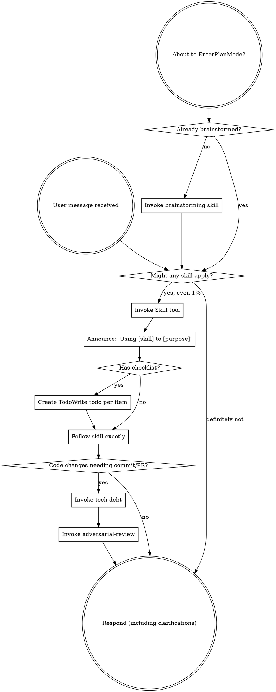

<SUBAGENT-STOP>
If you were dispatched as a subagent to execute a specific task, skip this skill.
</SUBAGENT-STOP>

<EXTREMELY-IMPORTANT>
If you think there is even a 1% chance a skill might apply to what you are doing, you ABSOLUTELY MUST invoke the skill.

IF A SKILL APPLIES TO YOUR TASK, YOU DO NOT HAVE A CHOICE. YOU MUST USE IT.

This is not negotiable. This is not optional. You cannot rationalize your way out of this.
</EXTREMELY-IMPORTANT>

## Instruction Priority

Superpowers skills override default system prompt behavior, but **user instructions always take precedence**:

1. **User's explicit instructions** (CLAUDE.md, GEMINI.md, AGENTS.md, direct requests) — highest priority
2. **Superpowers skills** — override default system behavior where they conflict
3. **Default system prompt** — lowest priority

If CLAUDE.md, GEMINI.md, or AGENTS.md says "don't use TDD" and a skill says "always use TDD," follow the user's instructions. The user is in control.

## How to Access Skills

**In Claude Code:** Use the `Skill` tool. When you invoke a skill, its content is loaded and presented to you—follow it directly. Never use the Read tool on skill files.

**In Copilot CLI:** Use the `skill` tool. Skills are auto-discovered from installed plugins. The `skill` tool works the same as Claude Code's `Skill` tool.

**In Gemini CLI:** Skills activate via the `activate_skill` tool. Gemini loads skill metadata at session start and activates the full content on demand.

**In other environments:** Check your platform's documentation for how skills are loaded.

## Platform Adaptation

Skills use Claude Code tool names. Non-CC platforms: see `references/copilot-tools.md` (Copilot CLI), `references/codex-tools.md` (Codex) for tool equivalents. Gemini CLI users get the tool mapping loaded automatically via GEMINI.md.

# Using Skills

## The Rule

**Invoke relevant or requested skills BEFORE any response or action.** Even a 1% chance a skill might apply means that you should invoke the skill to check. If an invoked skill turns out to be wrong for the situation, you don't need to use it.

## Red Flags

These thoughts mean STOP—you're rationalizing:

| Thought | Reality |
|---------|---------|
| "This is just a simple question" | Questions are tasks. Check for skills. |
| "I need more context first" | Skill check comes BEFORE clarifying questions. |
| "Let me explore the codebase first" | Skills tell you HOW to explore. Check first. |
| "I can check git/files quickly" | Files lack conversation context. Check for skills. |
| "Let me gather information first" | Skills tell you HOW to gather information. |
| "This doesn't need a formal skill" | If a skill exists, use it. |
| "I remember this skill" | Skills evolve. Read current version. |
| "This doesn't count as a task" | Action = task. Check for skills. |
| "The skill is overkill" | Simple things become complex. Use it. |
| "I'll just do this one thing first" | Check BEFORE doing anything. |
| "This feels productive" | Undisciplined action wastes time. Skills prevent this. |
| "I know what that means" | Knowing the concept ≠ using the skill. Invoke it. |

## Skill Priority

When multiple skills could apply, use this order:

1. **Process skills first** (brainstorming, debugging) - these determine HOW to approach the task
2. **Implementation skills second** (frontend-design, mcp-builder) - these guide execution

"Let's build X" → brainstorming first, then implementation skills.
"Fix this bug" → debugging first, then domain-specific skills.

## Skill Types

**Rigid** (TDD, debugging): Follow exactly. Don't adapt away discipline.

**Flexible** (patterns): Adapt principles to context.

The skill itself tells you which.

## User Instructions

Instructions say WHAT, not HOW. "Add X" or "Fix Y" doesn't mean skip workflows.

## Mandatory Completion Gates — tech-debt → adversarial-review (FINAL steps, called ONCE)

### The Unconditional Rule

**tech-debt and adversarial-review are the LAST two skills you call before any commit or PR — called exactly once, at the end of the overall workflow.**

Order: **tech-debt first** → **adversarial-review second** → then commit/PR.

These are NOT part of the initial skill-invocation flow. Do NOT call them at the start of a task. Call them only when all implementation is complete and you are about to commit or create a PR.

These gates are absolute. They are NOT subject to skill priority ordering. If the skill call order in any other section of this document changes, these gates remain — tech-debt then adversarial-review, as the final steps before every commit or PR.

### When to Call (exactly once per commit/PR)

Call these gates at the **end** of the workflow, when:
- All implementation is complete
- You are about to run `git commit`, `git push`, or create a PR
- No more code changes are expected before the commit

Do NOT call them:
- At the start of a task
- Mid-workflow
- After every small change
- Multiple times for the same commit

### Exemptions

Only when ALL changes are:
- Test-only (`test_*.py`, `*_test.*`, `*.test.*`)
- Documentation-only (`.md`, `.rst`, docstrings)
- Comment-only changes
- Single-line changes
- Non-code related tasks

### Rationalization Table

| Excuse | Reality |
|--------|---------|
| "Other reviews cover it" | No other review substitutes for adversarial review. |
| "I already tested it" | Testing and adversarial review catch different things. Both required. |
| "Tech debt isn't relevant here" | The skill evaluates that, not your pre-judgment. Invoke it. |
| "I'm just following the plan" | Plans do not grant exemptions. These gates are absolute. |
| "This is just a small fix" | Small fixes ship bugs. Run the gates. |
| "I don't have time" | The gates take minutes. Unreviewed code costs hours. |
| "This skill already handles quality" | No single skill substitutes for these completion gates. |

### Red Flags — STOP

- "I know what tech-debt would say, I don't need to invoke it"
- "Adversarial review is overkill for this change"
- "I've already reviewed the code myself"
- "Committing now, I'll review later"
- "The plan/instructions didn't mention these gates"
- "I already called tech-debt/adversarial-review earlier in the workflow"
- "I followed the Skill Priority order and these weren't listed"

**All of these mean: STOP. Invoke the mandatory final gates: tech-debt → adversarial-review. These are the last two skills you call before committing. Once.**
